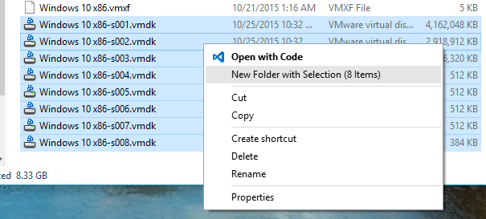

# Folderizer
A shell extension that moves selected files into a new folder.

# Supported environment
Microsoft windows 10, windows 8, windows 7

# Install
1. Download and unzip [installFolderizer.zip](http://oz.nthu.edu.tw/~u932014/installFolderizer.zip).
2. Depending on your OS version, right click on either *install_win7[.bat]* or *install_win8_win10[.bat]*; in the context menu, click *run as administrator*.
3. Enjoy.
